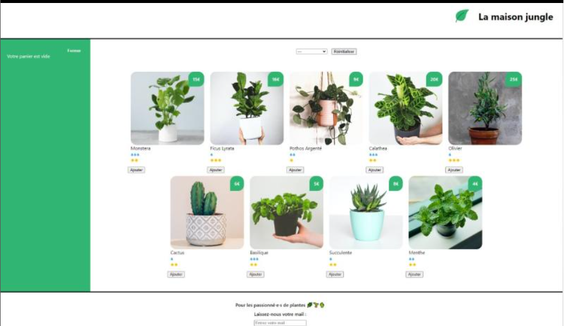

# 🌿 La maison jungle

Application web moderne conçue avec React, offrant une plateforme intuitive pour l’achat et la vente de plantes. Elle vise à connecter les amateurs de botanique et à faciliter l’accès à une variété de plantes, qu’elles soient d’intérieur, d’extérieur, exotiques ou locales.

## 🌐 Technologies appliquées

- 
- 

## 🛠️ Outils

- 

## 📷 Captures d’écran

## 🔗 Liens vers la démo

